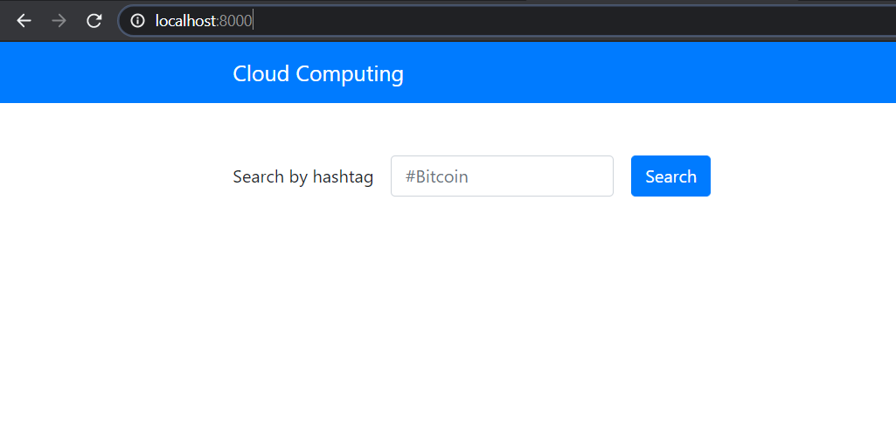
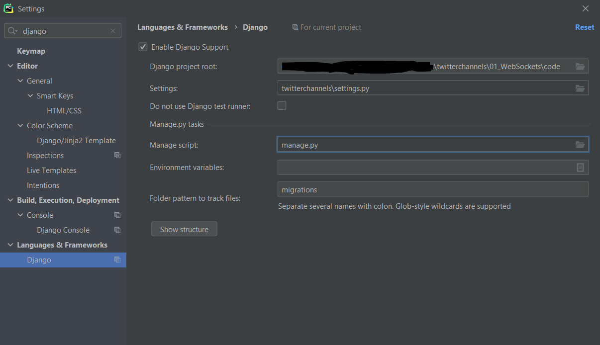
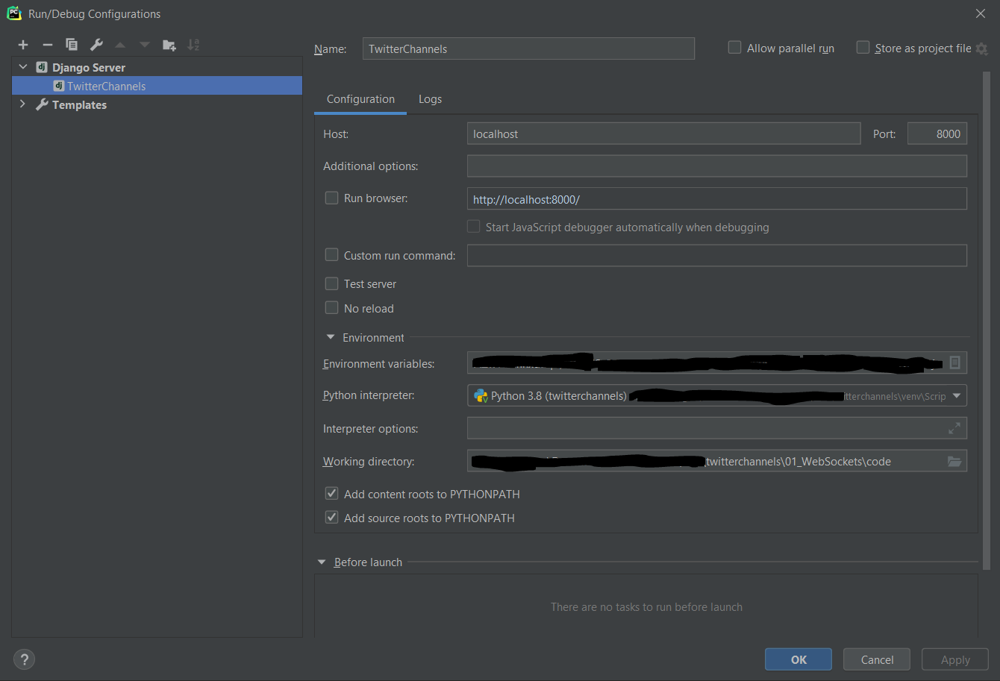
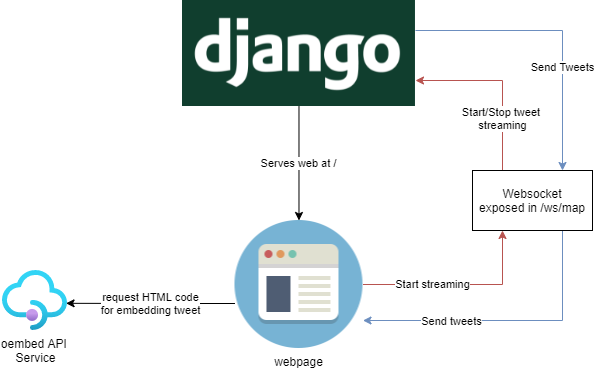
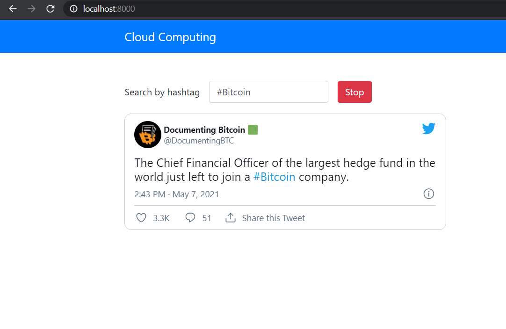

# Research project - WebSockets

Simple example to show the use of websockets to update a webpage view when 
new data is gathered.  

In this example, we will generate a streaming providing us of tweets with
a given word or hashtag.

## Introduction - WebSockets
WebSocket is a computer communications protocol, that provides a bi-directional communication using a single
TCP connection. Visually, we could imagine a websocket as a pipe, where traffic can flow from one end to another. 

This communication protocol offers a low overhead establishing and maintaining the communication as well a minimal overhead
per message. Nowadays this protocol can be found in many real time applications that need a low latency communication
without having a high overhead using a polling policy in order to receive new data. For instance many multiplayer games
and collaborative editing or coding platforms benefits from this technology.

## Twitter-channels
In this lab session we are going to deploy a Django instance that will serve a webpage, which unique 
functionality is showing a stream of tweets that includes a certain word or text. Notice that, the stream
of tweets will be provided from a different endpoint, hosted by the same Django instance, and the static webpage will only receive this tweets and visualize
them in a fancy way.

### Task 1 Configure Python Environment
First, we need to open the folder containing the code associated to this project.
Then, we will create and activate a virtualenv for running the Django instance in local.
`````shell
pip install virtualenv
virtualenv venv
``````
Following, we can activate the virtualenv we have just created.
````shell
#Activate using Linux
source venv/bin/activate
#Activate using Windows
\venv\Scripts\activate
`````
At any moment we can deactivate the virtualenv just typing `deactivate`.

Now that we have our python environment set, we will install the project dependencies.
````shell
pip install -r requirements.txt
````
This projects uses the Twitter API for creating the tweets streaming that will be visualized in the 
static webpage. That's why we also need to declare the following environment variables, so our client
(`tweepy`) can be authenticated against Twitter API.
````shell
export CONSUMER_KEY=[YOUR TWITTER CONSUMER KEY]
export CONSUMER_SECRET=[YOUR TWITTER CONSUMER SECRET]
export ACCESS_TOKEN=[YOUR TWITTER ACCESS TOKEN]
export ACCESS_SECRET=[YOUR TWITTER ACCESS SECRET]
````
Now, we can run our django server
````shell
python manage.py runserver
````
If everything went fine, we should see our static webpage deployed in <https://localhost:8000>



Play a bit with the webpage, fill the input box and click the search button, a carrousel of tweets
containing the text you set should start, leaving each tweet visible for 10 seconds more or less.
#### Running from the IDE (Optional)
If you are having some troubles getting the django instance up and running, we recommend you to 
check the django framework settings in you ide, indicating the `manage.py` and `settings.py` files location.




If you are still having some problem, you can try to clone our repo https://github.com/TheMatrix97/twitterchannels 


### Task 2 Understand the code
In this section, we wil try to understand how this application works. The following schema shows 
the current communication channels in our web application.



First, the static webpage is served from the root endpoint `/`, when this page loads it connects
to the websocket exposed in `/ws/map`, as we can see in [map/routing.py](code/map/routing.py) file, instantiating a new
websocket for every CONNECT REQUEST
````python
# map/routing.py
from django.conf.urls import url

from . import consumers

websocket_urlpatterns = [
    url(r'^ws/map/$', consumers.MapConsumer.as_asgi()),
]
````
from the webpage side:
````js
var  tweetsSocket = new WebSocket('ws://' + window.location.host + '/ws/map/');
tweetsSocket.addEventListener('open', webSocketOpen);

function webSocketOpen(e) {
    // Enable search button
    $('#searchButton').removeClass('disabled');
}
````
Once the search button is pressed in the front-end part, it sends a message through the websocket triggering
the streaming, the message have the following structure:
````json
{
  "type": "listen",
  "message": "[text entered]"
}
````
When the django instance receives some message through the websocket, the function `receive` will be called,
creating a new tweet Stream, as we saw in previous lab sessions. Notice that when receiving a `stop` command it
stops the streaming.
````python
class MapConsumer(WebsocketConsumer):
    ...
    ...
    def receive(self, text_data):
        text_data_json = json.loads(text_data)
        if text_data_json['type'] == 'listen':
            message = text_data_json['message']
            self.twitter_stream = Stream(auth=self.auth, listener=MyListener(self))
            # Create a new stream and filter by text
            self.twitter_stream.filter(track=[message], is_async=True)
        elif text_data_json['type'] == 'stop' and self.twitter_stream is not None:
            self.twitter_stream.disconnect()
    ...
    ...
````
Once the streaming is started, everytime a new tweet is obtained the following routine `on_data` it's called
`````python
class MyListener(StreamListener):
    ...
    ...
    def on_data(self, data):
        tweet = json.loads(data)
        # Send message to connected browser
        url = "https://twitter.com/twitter/statuses/"+str(tweet['id'])
        if tweet['retweeted']:
            return True

        if not self.first:
            #For consecutive tweets wait 10 seconds for not overflowding
            time.sleep(10)
        else:
            self.first = False
        #Send tweet url via websocket
        self.consumer.send(text_data=json.dumps({
            'type': 'tweet',
            'url': url
        }))
        return True
    ...
    ...
`````
Notice that, we are just generating the tweet url using the same tweet id and then sending this information
back to the front-end using the same websocket with a message type `tweet`, triggering the execution
of the `webSocketMessage` function. For that once we got the tweet url to print, we are calling 
the oembed service, so we can obtain the html to nicely embed the tweet in the webpage.
````js
function webSocketMessage(e) {
    var data = JSON.parse(e.data);
    if (data['type'] === 'tweet') {
        generateTweet(data['url'])
    }
}

function generateTweet(url){
    var urlOembed = "https://publish.twitter.com/oembed"
    $.ajax({
       type: 'GET',
       dataType: "jsonp",
       url: urlOembed+'?url='+url,
       success: function(data){
           $('#container-tweet').fadeOut();
           var tweet = $(data['html'])
           $('#container-tweet').html(tweet);
           $('#container-tweet').fadeIn();
        }
    });
}
````
### Task 3 - Test the code
That's it, at this point we are sure that you have become a websockets master, so let's play a bit with the application.
For example, if we try to search tweets with the keyword `#Bitcoin` we should see something like this:



Whenever you want, the streaming can be stopped just pressing the stop button.


### Check this documentation for background information

- [WebSockets](https://www.websocket.org/aboutwebsocket.html)
- WebSockets for Django: [Django Channels](https://channels.readthedocs.io/en/latest/)
- Twitter streaming: [Streaming With Tweepy](http://docs.tweepy.org/en/v3.4.0/streaming_how_to.html)
