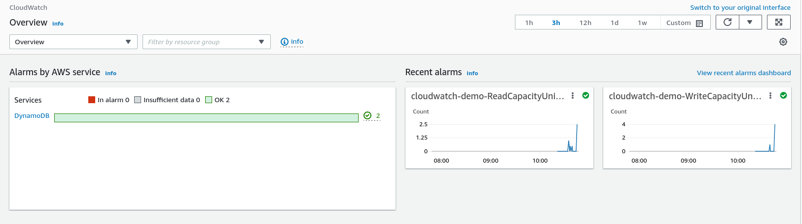
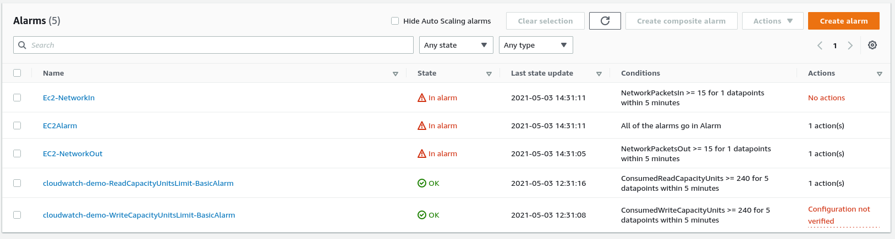
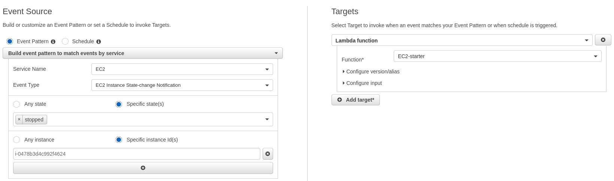

# Using CloudWatch to monitor and manage AWS resources.

---

Amazon CloudWatch is a service that automatically monitors the AWS resources and services we have running. With Cloudwatch we can visualize the metrics of our services and create alarms that automatically notify us in indicated situations or respond autonomously to certain events.

A detail to take into account is that when using the free AWS Cloudwatch layer, it does not monitor in slots shorter than 5 minutes, this restriction will not affect the practice but it can be a limitation for a later use of Cloudwatch.

## Prerequisites

In order to explain more clearly how CloudWatch works, we will proceed to create 3 new Amazon services that we can delete at the end of the practice. We will create an EC2 instance, and a DynamoDB table.

For the DynamoDB table we will create a new table from the [DynamoDB Console](https://eu-west-1.console.aws.amazon.com/dynamodb/home?region=eu-west-1#gettingStarted:), the name of the table will be and as primary key we will indicate id and we will choose the default options. If we look at the list of default options of DynamoDB we will see that it is creating Alarms, this is one of the functions of CloudWatch that we will see later.

For the EC2 we will create an Amazon Linux 2 instance that is inside the free tier, as the only thing we will use the EC2 for is to monitor its behavior we do not need any specific instance. Select the tier t2.micro and choose review and launch to finish the process and launch the instance.

With the services already created now we have to generate some consumption to get data to visualize, first we will generate activity in DynamoDB by writing some entries either from the DynamoDB Console or the CLI, as we find easier and more comfortable. In the case of the EC2 we will connect to it and perform the process of updating the Linux repositories, this can be done by executing the command

```bash
$ sudo yum update
```

With this done we will have some information to display in CloudWatch.

## Display of resources in CloudWatch

Accessing the [CloudWatch console](https://eu-west-1.console.aws.amazon.com/cloudwatch/home?region=eu-west-1#home:) will open the default panel that at the beginning is a little empty, if we can view the alarms that AWS has created by default when generating the DynamoDB and the graphs with the reads and writes of the DynamoDB.




The first function that we will see of Cloudwatch is the metrics visualization, the metrics are data that AWS records of all our services and running instances that we can consult. For this we have the function to create custom Dashboards, as in Elastic, but this time visualizing the metrics of our elements in AWS. Now we have to add Widgets to the Dashboard that allow us to visualize the elements we want to monitor and we build it. For now we only want a Dashboard with metrics, we will add logs later. 

Our goal is to create a dashboard that monitors the most important elements of our two instances. The EC2 consumption of both CPU and network resources and the write and read capacity of DynamoDB, with the dashboard already created we save it with any name we desire, if the name we choose is CloudWatch-Default it will appear at the main page of CloudWatch. Now with the Dashboard already generated we can interact more with our instances to observe how the graphs are updated and we can see if they correspond to our actions.

## Automatic alarms with CloudWatch

Another feature of CloudWatch is the creation of Alarms, automatic alerts to situations that we have previously indicated, this allows us to add notifications in two main cases, when an unexpected behavior occurs in our AWS services or when events occur that affect our AWS costs. To do this we must first create a notification channel and subscribe to it, access the [SNS console](https://eu-west-1.console.aws.amazon.com/sns/v3/home?region=eu-west-1#/homepage) and create a new topic. We create a standard topic and with the default configuration, and with the topic created we subscribe to it with our mail.

Now we access to the CloudWatch Alarms and we see that we already have two alarms created, this are the DynamoDB alarms that are created by default but they are partially configured, we can correct them later only lack a valid SNS topic, now we will create a new alarm. As we want an alarm that we can see now during practice we must choose a situation that is easy to trigger, we can see this by looking at our dashboard graphs, my recommendation is the EC2 input or output packets, which can trigger the alarm just by connecting. We choose the alarm conditions and in the notification option we choose the topic we created previously, the other options can stay by default.

Now we connect to the EC2 and wait, by default the Alarms wait for 5 minutes in the specified condition to trigger, after a some time we will receive the email with the alarm and in CloudWatch we will see our alarm as active. Now we close the connection and wait a little more to see that our alarm has ended. If we check the specified alarm in the CloudWatch console we can obtain some more information like the history of the alarm or the duration.

Another kind of alarm that we can create is a composite alarm, an alarm formed by a group of alarms, for this we will create one more alarms for the EC2 with the metric we choose, and with this two alarms we will create a composite alarm. We select both alarm and choose create composite alarm, in the first option we chose the logical behavior of the alarm, we replace the Or with an AND and we follow the steps like in the following alarms and then we will have our alarm created. Now we trigger the alarm condition and see if our composite alarm works, if we done everything correctly our panel should look like this:



## Events and automatic responses in CloudWatch

The last feature we will see are the CloudWatch events, with this function we can make Amazon respond automatically to certain events. For our exercise we will create an event so that when our EC2 composite alarms is activated we will reboot out EC2 instance. First we will modify one of our alarms to stop our instance when the alarm triggers. We choose one of the alarms and edit it to add an EC2 action when it triggers, selecting the option to stop our instance.

Now for the restart we will need and event and a the lambda to restart the EC2, for this we need tho create the following policy to a roll for our lambda

```jsonplainText
{
  "Version": "2012-10-17",
  "Statement": [
    {
      "Effect": "Allow",
      "Action": [
        "logs:CreateLogGroup",
        "logs:CreateLogStream",
        "logs:PutLogEvents"
      ],
      "Resource": "arn:aws:logs:*:*:*"
    },
    {
      "Effect": "Allow",
      "Action": [
        "ec2:Start*",
        "ec2:Stop*"
      ],
      "Resource": "*"
    }
  ]
}
```

With the role and the policy created we add the following code to out lambda replacing the instances by our EC2 id.

```python
import boto3
region = 'eu-west-1'
instances = ['i-12345cb6de4f78g9h',]
ec2 = boto3.client('ec2', region_name=region)

def lambda_handler(event, context):
    ec2.start_instances(InstanceIds=instances)
    print('started your instances: ' + str(instances))
```

With the lambda ready we can create the CloudWatch event, the events can be scheduled actions or events triggered by a pattern we select a pattern and indicate to trigger when our EC2 instance is stoped, and as targets we select our newly created lambda.



Now we trigger the alarm and we will see how we are notified and our Instance is automatically restarted. But what if we want to use our composite alarm for the reboot, in this case we can make the alarm to stop the EC2 instance because isn't an EC2 alarm, for this we need to make some changes to our notifications system and create a new lambda.

First of all we create a new lambda like the previous one, but this will stop the instance, the code will be this and we can give the same role like the previous lambda.

```python
import boto3
region = 'eu-west-1'
instances = ['i-12345cb6de4f78g9h',]
ec2 = boto3.client('ec2', region_name=region)

def lambda_handler(event, context):
    ec2.stop_instances(InstanceIds=instances)
    print('started your instances: ' + str(instances))
```

Now we will modify or SNS topic for the Alarms to add a new subscription in addition to our mail, but in this case the protocol will be a Lambda and we will choose or Lambda to stop instances. With this done now when the Alarm triggers send us a mail and sends the notification to execute to our Lambda, which will stop our instance. The when our instance is stopped our CloudWatch event will restart the instance with the Lambda.

## CloudWatch Logs

Now that we have Lambdas created we can see the last element of CloudWatch, the logger service. For the logs we can see two things, the logs directly as AWS generates them and the metrics derived from these logs. In the case of metrics these now appear in the metrics menu and can be added to a dashboard like the other elements of the instances so we will cover them very lightly. Now in the metrics we will be able to observe the graphs of number of executions, errors and duration of each one of the lambdas that we currently have.

Now the log log is different, if we access the log groups menu we will see an entry for all the lambdas we have, we select one of the lambdas on we can acces the log for every one of our executions, if we open one of the logs we will see something similar to this

```
START RequestId: 93bcf345-cf73-4115-8cc5-9f53a3ec783d Version: $LATEST
started your instances: ['i-0478b3d4c992f4624']
END RequestId: 93bcf345-cf73-4115-8cc5-9f53a3ec783d
REPORT RequestId: 93bcf345-cf73-4115-8cc5-9f53a3ec783d	Duration: 520.07 ms	Billed Duration: 521 ms	Memory Size: 128 MB	Max Memory Used: 82 MB	Init Duration: 364.60 ms	
```

The START and END entries in the log are automated entries added by AWS to indicate when the Lambda start and ends the execution, the message between is a log message we added ourselves to the Lambda with the print. The last is the report of the execution when indicate te resources consumed, and mose important the execution time of the Lambda AWS will bill us.

