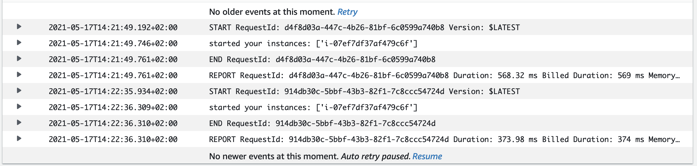
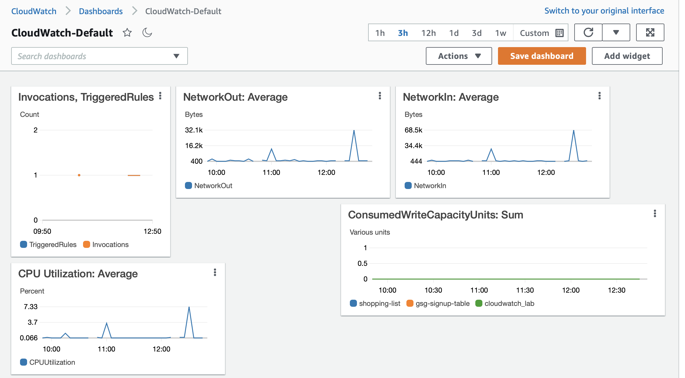

# Using CloudWatch to monitor and manage AWS resources - Evaluation
In this lab we are going to use CloudWatch to manage and monitor AWS resources. 

### Prerequisites

We created a new DynamoDB table and added some dummy data in it. 

Afterwards we created an EC2 instance and updated the Linux repositories in order to generate data that could be visualized afterwards.


### Display of resources in CloudWatch

In this task we created a dashboard. It visualized certain metrics (records that indicate state of used services and running instances).
Dashboard displays the most important information about 2 services that we are currently using: EC2 consumption of CPU and network resources 
as well as the write/read capacity of DynamoDB. We chose the name "CloudWatch-Default" and thus made a dashboard appear on the main page of CloudWatch.


### Automatic alarms with CloudWatch

In this task we had to create alarms - automatic alerts for certain previously indicated events. 
We used an SNS (Amazon Simple Notification Service) to create a notification channel and subscribe to it. Now when alarms will be triggered - 
we will get a notification about it via email.


Next we had to create an alarm. We chose one that was easy to trigger - the EC2 input or output packets, it can trigger the alarm just by an attempt to connect to the instance. 
We specified alarm conditions and chose previously created notification option. We waited until alarm was triggered and received a corresponding email. 


We could also observe alarm information and logs in the console.


Afterwards we created another alarm and a composite alarm that had to be triggered in case both of previously created alarms were triggered.


We made sure that everything worked correctly when we received corresponding emails.


### Events and automatic responses in CloudWatch

In this task we had to create events - functions that make services automatically respond to certain events. We had to create an event that 
would reboot an EC2 instance in case composite alarm is triggered. 
Firstly, we modified an alarm and added an EC2 action that would stop an instance in case alarm is triggered.


Secondly, we created a policy that we assigned to the role for a lambda that we created afterwards. 


Then using the following code we created Lambda that had to start an instance

```
import boto3
region = 'eu-west-1'
instances = ['i-12345cb6de4f78g9h',]
ec2 = boto3.client('ec2', region_name=region)

def lambda_handler(event, context):
    ec2.start_instances(InstanceIds=instances)
    print('started your instances: ' + str(instances))
```

We created a CloudWatch event that is triggered by a selected pattern and calls specified lambda function.


Finally, we could trigger an event (stop an instance) and an instance was automatically restarted.


Now we had to use a composite alarm for reboot: once composite alarm is triggered, we receive an email, lambda is triggered and stops instance and then CloudWatch event calls another lambda to start an instance again. Thus, we created new lambda with the same policy attached and with the following code

```
import boto3
region = 'eu-west-1'
instances = ['i-12345cb6de4f78g9h',]
ec2 = boto3.client('ec2', region_name=region)

def lambda_handler(event, context):
    ec2.stop_instances(InstanceIds=instances)
    print('started your instances: ' + str(instances))
```

and added a new lambda subscription to the existing SNS topic.


Afterwards we triggered composite alarms by connecting to an instance.


Following logs we could see that an instance was stopped and then started again:




### CloudWatch Logs

Now we could observe and analyze metrics generated from the CloudWatch logs and add them to the dashboard.



We also can access each log separately:

```
START RequestId: ee5f5e2c-1aa8-4250-87b7-9fc00d5feeeb Version: $LATEST
started your instances: ['i-07ef7df37af479c6f']
END RequestId: ee5f5e2c-1aa8-4250-87b7-9fc00d5feeeb
REPORT RequestId: ee5f5e2c-1aa8-4250-87b7-9fc00d5feeeb	
Duration: 642.35 ms	
Billed Duration: 643 ms	
Memory Size: 128 MB	Max Memory Used: 84 MB	
Init Duration: 352.29 ms	
```

### Feedback for the authors
Topic and lab session were interesting and useful. However, session has couple of flaws. First of all, due to errors and misprints in the text, 
sometimes it was very complicated to understand what was going on in the task and how it had to be completed. I would recommend 
to reread text before submitting. Also task "Automatic alarms with CloudWatch" was confusing sometimes (partially because of the problem mentioned above), 
in my opinion it was necessary to provide more detailed and clear instructions (I spent a lot of time trying to understand 
the task itself and had to check additional sources to complete it). 

### Grade
8.0
