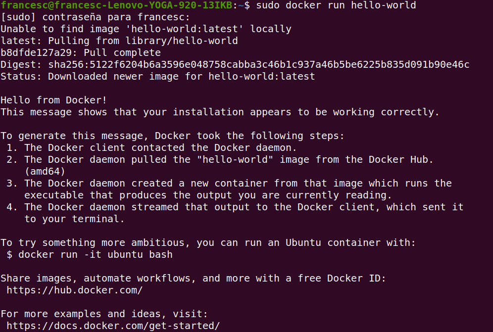
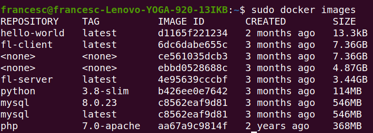
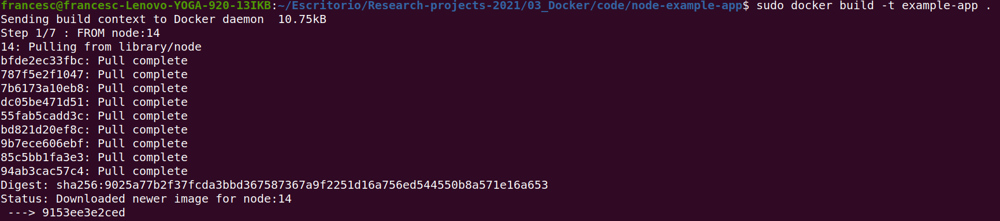
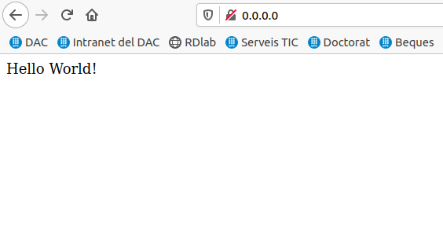
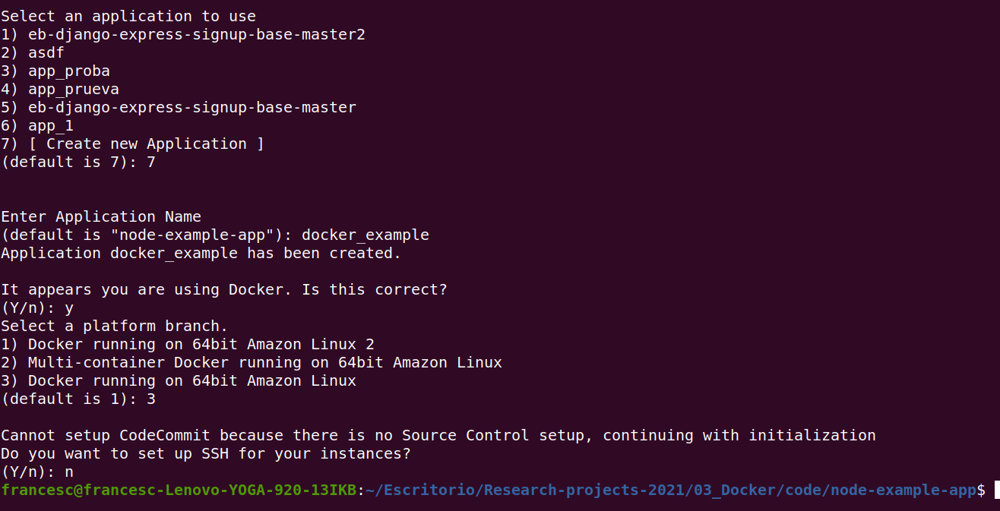
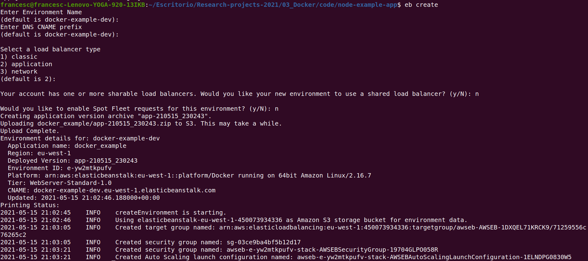
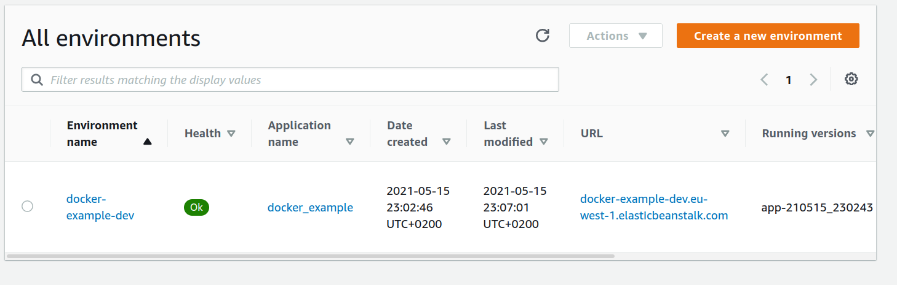
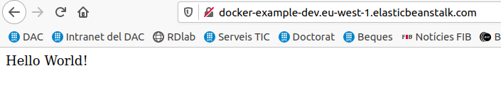

# Research project Docker answers

# Install and get started with Docker

# Create your own image

# Running our image locally

**Question: Try running the previous command with the -d option and without it and explain what happens.**

If we run it with the -d option we are running in detach mode.

# Use our docker image in AWS

Deploy your image to AWS:

Environments in AWS:

It works!

# Feedback for the authors

It is a nice starting tutorial for Docker if you have never worked with it before.
However it would have been nice to add some part of mounting volumes or creating 
docker internal networks.

# Grade

7.0

