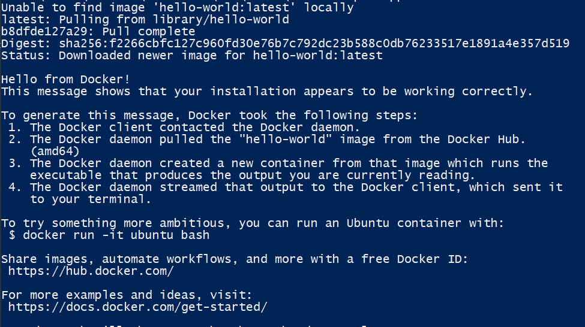
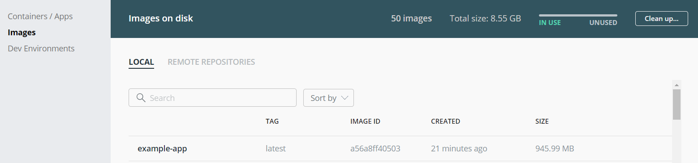
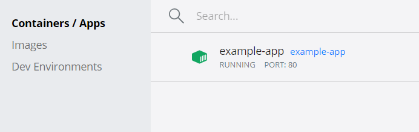
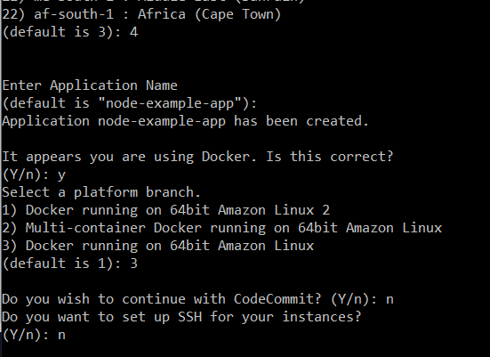
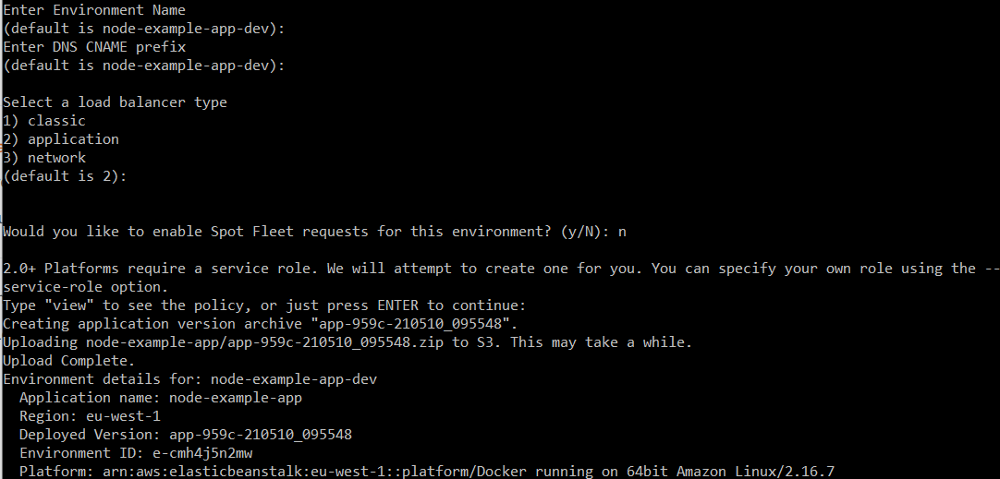
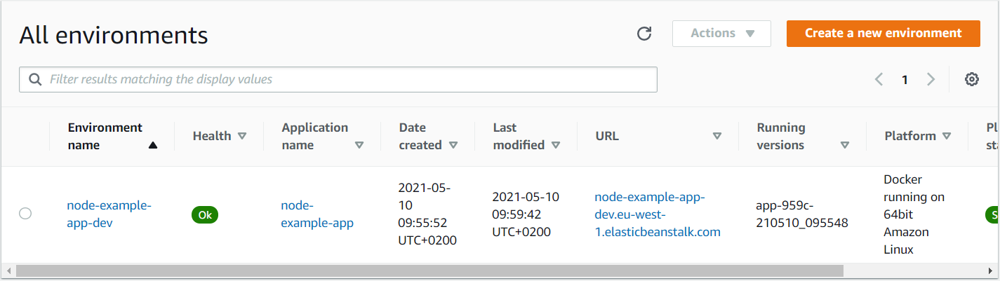

# Research project - Docker

This is a simple tutorial, where the basics of Docker will be introduced to you. 

In this tutorial, you will create a small app that 

## What is Docker?
[Docker](https://www.docker.com/) is an open-source tool which provides virtualization on OS level. It uses reusable *containers* to make it more convenient to qucikly and consistently deploy and run applications.

A container isolates the app that it hosts from the operating system, shipping it with a separate libraries and other dependencies. In this sense, containers are like virtual machines, but they are lighter - they do not need to emulate the whole operating system, just the essentials. An *image*, on the other hand, provides a custom file system for the container. It also stores all dependencies, configuration, scripts and other metadata. Docker creates an image by reading data from the `Dockerfile`, which is a text file containing instructions in a specific format and order.


## Install and get started with Docker

Follow [these instructions](https://docs.docker.com/engine/install/) to install Docker appropriate for your machine.

To get acquianted with Docker, run:

```
docker run hello-world
```
This command downloads the `hello-world` image from Docker's servers and runs it in a container. This example is pretty simple, it just prints a message.



Run `docker images` to see what images are stored on your computer. 


## Create your own image
To create our own image we will download a sample node project. You don't even need node installed for this tutorial, this is the power of Docker.

We will clone [this repo](https://github.com/Guillembonet/node-example-app) which contains a sample hello world node app with a Dockerfile.

### Understanding the Dockerfile
The dockerfile has the following directives:

```
FROM node:14
```
This directive establishes node as the base image of our image.

```
WORKDIR /app

COPY package*.json ./
RUN npm install
```
With these lines we create a working directory and copy the package.json (which contains our dependencies) to the working directory.
With RUN npm install we install this dependencies.

```
COPY . .
```
We copy all the files from our folder to the working directory (except the folders specified in .dockerignore)

```
EXPOSE 3000
CMD [ "node", "app.js" ]
```
We expose port 3000 (which is set by default in app.js), and we set `node app.js` to be the first command our image will run, which deploys the node app.

### Building the image
To build our image we will use the following command inside of the root folder of our sample app:

```
docker build -t example-app .
```
This will create a image called "example-app" using the Dockerfile in the current directory.

You can see the image in docker desktop's images tab on windows or using `docker image ls`:



### Running our image locally
To run our image locally we need to use the following command:

```
docker run --name example-app-container -p 80:3000 -d example-app
```
With this command we will run a container called `example-app-container`, with port 3000 of the container mapped to the port 80 of the host machine, and the container will use our image and run in detached mode.

If the command works properly you should be able to access your app [here](http://localhost/)!

You can also see the container running on docker desktop's containers tab on windows or using `docker container ls`:



**Question: Try running the previous command with the -d option and without it and explain what happens.**
Note: you will have to delete the container to launch a new one with the same name.

## Use our docker image in AWS
Now that we have a docker image we can upload it into AWS and make our app run in the cloud.
### Deploy your image to AWS
To deploy our image we will use the eb CLI we used in previous tutorials to create an elastic beanstalk environment with our application.

Simply navigate to the root of the project and use:

```
eb init
```
You can leave all options to default and the output should look something like this:



Then we can create our elastic beanstalk with this command:
```
eb create
```
Leaving all options to default should have an output like this:



Then in a few minutes you should be able to navigate to the elastic beanstalk dashboard and see a new environment which contains your app running in the cloud.



## The end!
We hope you enjoyed the tutorial and hopefully learned something new!
